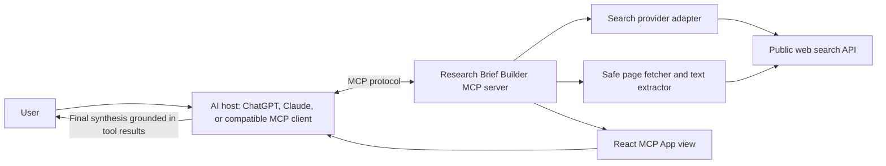

# High-Level Design: Research Brief Builder

**Status:** MVP implemented; original design retained below. See README for setup and current limits.

**Last updated:** 2026-10-02

**Implementation update (2026-10-04):** The two MCP tools and React views are implemented using mcp-use 2.7.3. Live search uses Brave behind the provider interface. An explicitly synthetic offline demo is the default. Retrieval supports HTML and plain text, with DNS-pinned connections, redirect checks, and response/deadline limits. Brief drafting remains the host assistant's responsibility; the view supplies selected retrieved evidence and provenance instructions, not automated claim verification.

## 1. Purpose

Research Brief Builder turns a user's question into a short brief grounded in inspectable public sources. It is an MCP server with a companion React view: the connected assistant chooses when to call the tools and drafts the brief from the evidence returned by those tools; the view helps the user inspect source metadata and evidence.

The MVP is a research aid, not an autonomous fact-checker. A valid citation link shows provenance, but does not by itself prove that a source supports a claim.

## 2. Goals and non-goals

### Goals

- Search for sources relevant to a focused question.
- Make source title, URL, publication date (when available), and snippet visible.
- Retrieve readable text from a user-selected public page.
- Return typed, bounded results that an assistant can use to draft a cited brief.
- Explain partial results and retrieval failures without silently dropping sources.
- Make the search provider replaceable.

### Non-goals for the MVP

- User accounts, saved history, team collaboration, or a database.
- Paywalled, authenticated, or private-source extraction.
- Autonomous multi-agent research or unattended publication.
- A guarantee that every claim is true or that a source entails a cited claim.

## 3. Users and primary use case

The user asks a bounded question, such as “What are the main trade-offs of heat pumps in cold climates?” They review search results, open selected source text, and ask the connected assistant to produce a short brief with claims linked to those sources. The user can inspect the source list and request another search when evidence is thin or conflicting.

## 4. System context

The AI host owns the conversation and synthesis. The MCP server provides search and retrieval capabilities plus structured results for the view. The server does not need its own model API for the MVP.

## 5. Logical components

| Component | Responsibility |
|---|---|
| MCP server entry point | Register tools, schemas, metadata, and view bindings. |
| `search_sources` tool | Validate the question and limits; call the search adapter; return normalized source records. |
| Search provider adapter | Isolate provider-specific API/auth/response details from the tools. |
| `fetch_source` tool | Accept a public URL; call the safe fetcher and return bounded readable text with metadata. |
| Safe page fetcher | Enforce URL/network restrictions, timeouts, redirect checks, content-type and size limits. |
| Text extractor | Convert supported HTML pages into clean text while retaining useful metadata. |
| Research results view | Render source cards, snippets, dates, URLs, and tool errors. |
| Assistant in the host | Choose tools, synthesize evidence into a brief, and cite source URLs returned by the tools. |

## 6. MCP tool contracts (proposed)

### `search_sources`

**Input:** `query` (required), optional `domains`, optional `maxResults` with a server-enforced upper bound.

**Output:** `query`, `sources[]` containing a stable-for-this-result `sourceId`, `title`, `url`, optional `publishedAt`, `snippet`, and `domain`, plus warnings when applicable.

**View:** source cards and search status.

### `fetch_source`

**Input:** `url` (required; later it may accept a `sourceId` if the client supplies the corresponding source record).

**Output:** canonical URL, title, optional publication date, extracted text, retrieval timestamp, and truncation/quality warnings.

**View:** source metadata and readable extracted text.

### Tool design rules

- Use Zod schemas and return structured output as well as a concise text summary.
- Enforce result-count, text-length, and timeout limits on the server even if the client passes larger values.
- Keep tool output self-contained; do not depend on per-session in-memory state for source identity.
- Include stable source URLs in results so citations can be traced across assistant turns.

## 7. Data flow

1. The host sends the user's question to `search_sources`.
2. The server validates it and asks the configured search adapter for a bounded list.
3. The host presents the structured result using the research view.
4. The user or host selects URLs for `fetch_source`.
5. The server validates and fetches each URL, extracts bounded text, and returns metadata plus warnings.
6. The host drafts the brief from the returned evidence and cites the source URLs.
7. The user inspects sources, challenges a claim, or asks for a refined search.

## 8. Trust, safety, and privacy

- Treat search snippets and fetched page text as untrusted data, never as instructions. The assistant should be told to ignore instructions embedded in source pages.
- Prevent server-side request forgery: allow only `http`/`https`, reject loopback, private, link-local, and reserved addresses, re-check each redirect, and guard against DNS rebinding.
- Set connection/read timeouts, maximum redirects, response-size limits, and a small allowlist of supported content types.
- Do not fetch authenticated pages or send secrets/cookies to source websites.
- Keep API keys in environment variables; never return them in tool output or logs.
- MVP should not persist queries or page contents. Explain that search queries are sent to the configured search provider.
- Return source links and retrieval metadata; distinguish unavailable pages, partial extraction, and truncated text.

## 9. Failure handling

| Failure | Expected behavior |
|---|---|
| Search provider timeout/rate limit | Return a clear retryable error; preserve provider-neutral error codes. |
| No results | Return an empty source array and suggest refining the query. |
| Invalid or unsafe URL | Reject before fetching and explain the restriction. |
| Unsupported content type or paywall | Return metadata if available and mark text as unavailable. |
| Extraction yields little text | Return partial result with a warning; do not fabricate content. |
| One source fails in a multi-source workflow | Keep successful sources and report each failed source separately. |

## 10. Deployment and operations

Develop locally with the `mcp-use` development server and Inspector. Configure the search API key through environment variables. Deploy only after the server's URL restrictions and response limits are in place. Keep the initial deployment stateless; add a database only when a real saved-history requirement exists.

## 11. MVP acceptance checklist

- A user can search and see source title, URL, snippet, and date when available.
- A user can retrieve readable text from a supported public page.
- Every brief citation points to a URL present in retrieved tool results.
- Unsafe URLs and redirects are rejected, and time/size limits are enforced.
- Empty, partial, and failed retrievals are clearly represented.
- The app does not claim source support or truth verification that it has not performed.

## 12. Main design risks

Search coverage varies by provider; web pages can block automated retrieval; publication dates may be missing or ambiguous; and language models can overstate what the sources support. Keep provenance visible, label uncertainty, and test representative research questions before expanding the scope.

## References

- [mcp-use TypeScript project and quickstart](https://github.com/mcp-use/mcp-use)
- [mcp-use TypeScript documentation](https://github.com/mcp-use/mcp-use/tree/main/docs/typescript)
