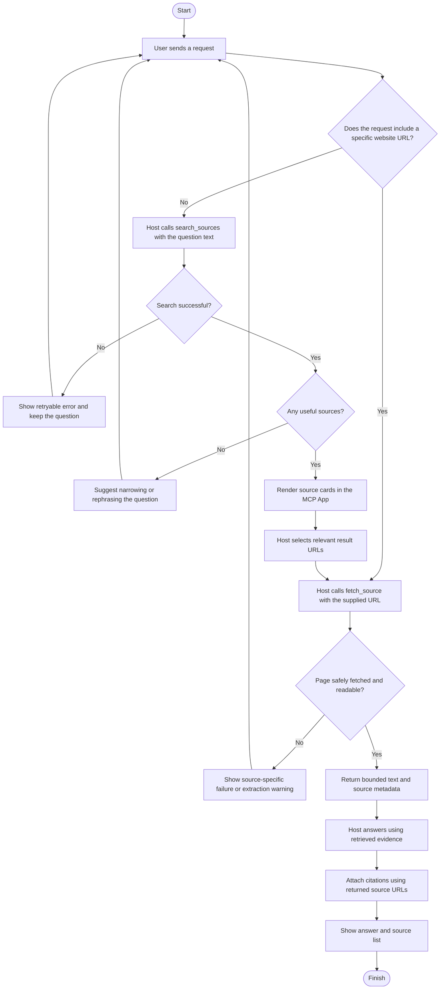
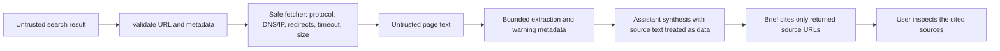

# Research Brief Builder Flowchart

## User workflow

## Trust boundary

The citation check in the MVP is about **provenance**: citations must point to sources returned by the tools. It does not automatically prove that a source supports a claim.
